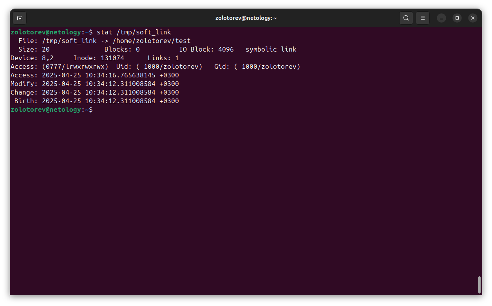

# Домашнее задание к занятию «Файловые системы»
### Золоторев Н.Д.

### Задание 1 

    1. Создайте каталог ~/test и в нём файл test_123 с любым содержимым.
    2. Создайте символическую ссылку на каталог ~/test по пути /tmp/soft_link.
    3. Используя ссылку /tmp/soft_link, скопируйте файл test_123 в каталог /tmp с тем же именем. Создайте жёсткую ссылку на файл /tmp/test_123 с именем /tmp/hard_link.

Вопрос 1. Файл ~/test и /tmp/test_123 — это один и тот же файл (одинаковые inode)?

Вопрос 2. Файл /tmp/soft_link и /tmp/hard_link — это один и тот же файл (одинаковые inode)?

Вопрос 3. Файл /tmp/test_123 и /tmp/hard_link — это один и тот же файл (одинаковые inode)?

Вопрос 4. Докажите, что одна из ссылок символическая, а другая жёсткая. Обязательно приложите к ответу скриншоты команд, которые иллюстрируют различия ссылок разного типа, или, если не уверены, ход решения задания.

### Решение 1

1. Нет, это разные файлы. Inode разные.

2. Нет, это разные файлы. Inode разные.

3. Файл один и тот же, так как нет разницы между жесткой ссылкой и этим файлом, все они относятся к одному и тому же Inode.

4. Символическая ссылка /tmp/soft_link ссылается на директорию test. При выводе команды stat ~/test/ то мы увидим, что ссылок на данную дерикторию 2, а жесткую ссылку на дерикторию сделать невозможно.
Жесткая ссылка /tmp/hard_link имеет одинаковые inode с файлом test_123, просто имеют разные имена. Соответственно нет никакой разницы между файлом test_123 и жесткой ссылкой /tmp/hard_link. 
 
 

### Задание 2

    1. Создайте файл ~/netology.
    2. Создайте каталог ~/netology/.
    3. Поместите файл netology в каталог netology.

Какое или какие из трёх действий невозможно выполнить? Почему?

### Решение 2

В Linux невозможно создать в одной директории файл и директорию с одним именем. В Linux всё есть файлы. Соответственно задание 2 и 3 выполнить невозможно.

### Задание 3

   1. Как посмотреть количество inodes?
   2. В каких файловых системах не может возникнуть проблемы нехватки inodes?

Запишите ответ в свободной форме.

### Решение 3

1. df -i

2. Проблемы нехватки inodes могут возникать в файловых системах, которые используют фиксированное количество inodes, таких как ext2, ext3 и ext4. Однако в некоторых файловых системах, таких как XFS и Btrfs, количество inodes может быть динамическим или масштабируемым, что снижает вероятность возникновения проблем с нехваткой inodes.

Таким образом, файловые системы, которые могут избежать проблем с нехваткой inodes, включают:

    1. XFS - динамическое распределение inodes.
    2. Btrfs - поддерживает динамическое управление inodes.
    3. ZFS - также использует динамическое распределение inodes.

Эти файловые системы более гибкие в управлении пространством и inodes, что позволяет избежать проблем, связанных с их нехваткой.

### Задание 4

Задание не предполагает использования LVM.

    1. Подключите к системе новый диск 3 Гб.
    2. Создайте на диске один раздел размером 2 Гб.
    3. Разметьте раздел как xfs.
    4 .Смонтируйте раздел по пути /mnt. Создайте любой файл на смонтированной файловой системе. Сделайте скриншот вывода команды df -hT.
    5. Увеличьте раздел до 3 Гб.
    6. Расширьте файловую систему на новое свободное пространство.
    7. Убедитесь, что после всех манипуляций созданный вами файл остался внутри раздела и файловой системы.
    8. Сделайте скриншот вывода команды df -hT.

В качестве ответа приложите два сделанных скриншота.

### Решение 4
 
 
 
 
 
 
 
 
 
 
 
 
  
 
 
